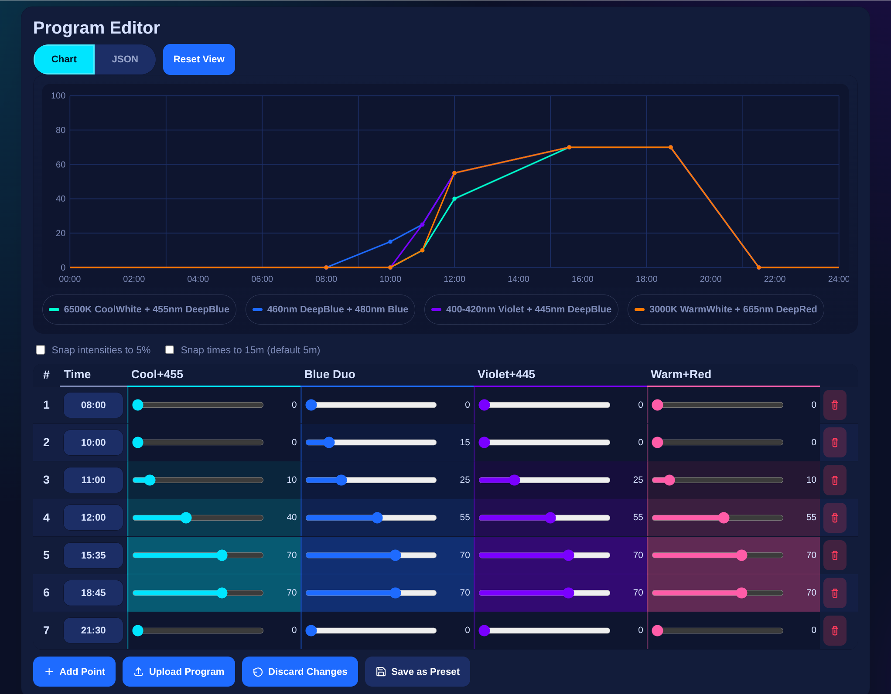

# Maxpect Lights Portal



Internal-only async Python portal to control Maxspect lights through an ICV6 controller.

## Internal Use Warning
This project is intended for trusted home/internal networks. It currently has no authentication.
Do not expose it directly to the public internet.

## Features
- Report current ICV6 mode (`manual` / `auto`).
- Set manual intensity for 4 channels.
- Edit/upload auto program points.
- Save, rename, delete, and load presets.
- Run program validation now or via backend polling.
- Healthcheck endpoint for app, DB, and device connectivity.

## Architecture
- `app/main.py`: FastAPI routes + exception mapping.
- `app/services/device_service.py`: device state/mode/intensity/program operations.
- `app/services/preset_service.py`: preset validation and CRUD behavior.
- `app/services/validation_service.py`: validation and polling config API layer.
- `app/services/validator.py`: async background validator loop.
- `app/services/icv6_client.py`: low-level binary protocol client.
- `app/db.py`: SQLite access + schema migrations.
- `app/static/`: portal frontend assets.

## Environment
Copy `.env.example` to `.env` and adjust values:

- `ICV6_HOST`: device endpoint host/IP.
- `ICV6_PORT`: device endpoint port.
- `ICV6_DEVICE_ID`: on-wire device id.
- `DATABASE_PATH`: SQLite path.
- `APP_PORT`: local web app port for `just dev`.

## Development
```bash
just setup
just init-env
just dev
```

## Docker Deploy
1. Copy env file:
```bash
cp .env.example .env
```

2. Edit `.env` with your real values (`ICV6_HOST`, `ICV6_PORT`, `ICV6_DEVICE_ID`).

3. Start:
```bash
docker compose up -d --build
```

4. Open:
```text
http://localhost:${APP_PORT}
```

Data is persisted in `./data_runtime/portal.db`.

### Optional helper commands
```bash
just docker-up
just docker-down
```

## Docker Hub Publish (CI)
This repo includes `.github/workflows/docker-publish.yml` to publish images automatically.

Set these GitHub repository secrets:
- `DOCKERHUB_USERNAME`
- `DOCKERHUB_TOKEN` (Docker Hub access token)

Publish behavior:
- Push to `main`: publishes `latest`, `main`, and `sha-*` tags.
- Push tag `v*.*.*`: publishes matching version tag.

## Quality Checks
```bash
just lint
just typecheck
just test
just coverage
just check
```

## API Summary
- `GET /healthz`
- `GET /api/state`
- `POST /api/mode`
- `POST /api/manual/intensity`
- `POST /api/program`
- `GET /api/presets`
- `POST /api/presets`
- `POST /api/presets/{id}/apply`
- `PATCH /api/presets/{id}`
- `DELETE /api/presets/{id}`
- `POST /api/validation/run`
- `GET /api/validation/latest`
- `GET /api/validation/polling`
- `POST /api/validation/polling`

## Protocol Notes
See `protocol.md` for reverse-engineered protocol details.
